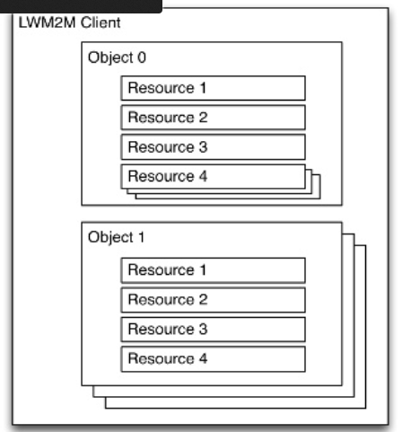
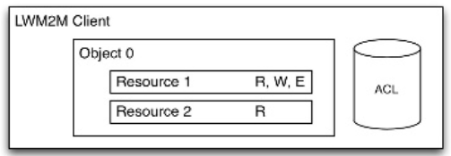
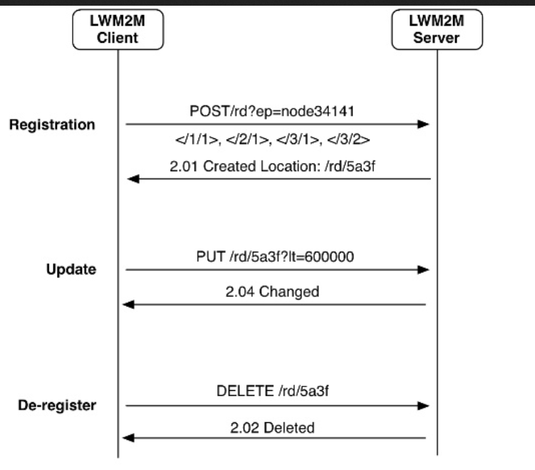
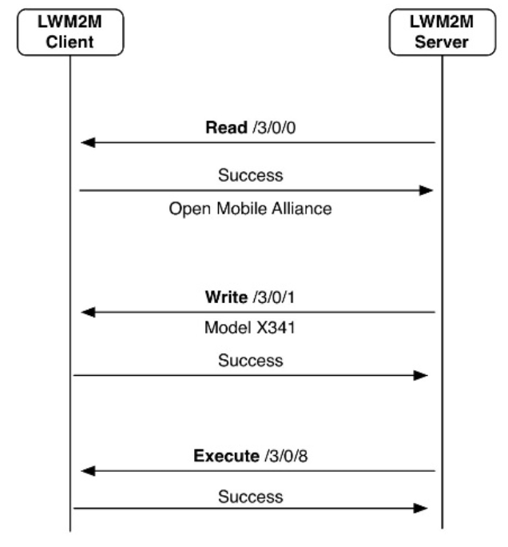
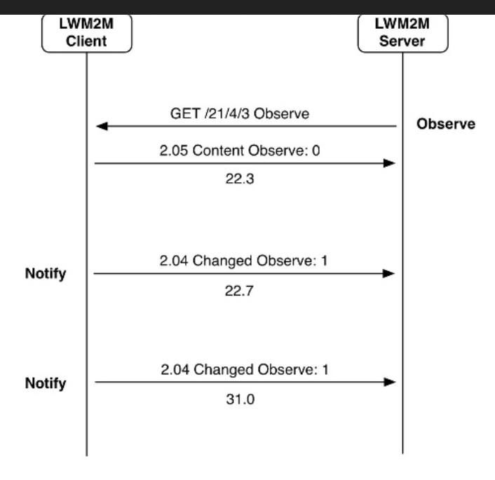
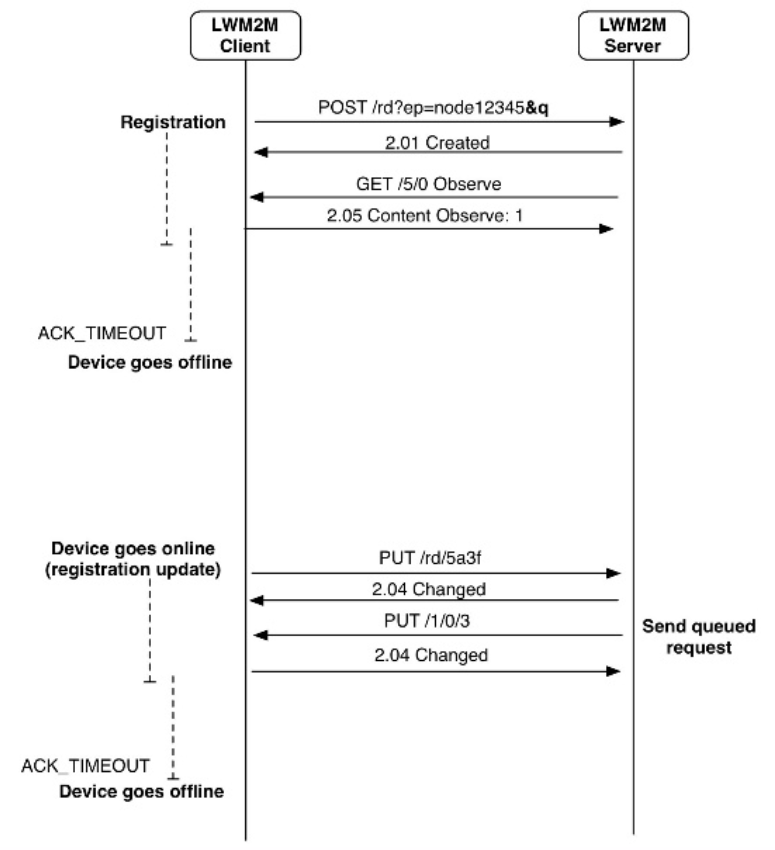

# OMA LWM2M

**Table of Contents**

<!-- START doctoc generated TOC please keep comment here to allow auto update -->
<!-- DON'T EDIT THIS SECTION, INSTEAD RE-RUN doctoc TO UPDATE -->
  - [Background](#)

- [Background](#background)
  - [OMA DM](#oma-dm)
  - [OMA LWM2M](#oma-lwm2m)
- [Built on COAP ?](#built-on-coap-)
- [What does LWM2M do ?](#what-does-lwm2m-do-)
  - [Device Management](#device-management)
  - [Application Data](#application-data)
- [What's in the Client ?](#whats-in-the-client-)
  - [Objects ?](#objects-)
  - [Management objects !](#management-objects-)
  - [Application objects !](#application-objects-)
    - [IPSO Objects](#ipso-objects)
      - [Ex : Luminance sensor : ID 3301](#ex--luminance-sensor--id-3301)
- [How does the server & the client talk ?](#how-does-the-server-&-the-client-talk-)
  - [Registration](#registration)
  - [Data interaction](#data-interaction)
    - [Read a data ?](#read-a-data-)
    - [WRITE  a data ?](#write--a-data-)
    - [OBSERVE a data ?](#observe-a-data-)
  - [Queue management](#queue-management)
- [What's on the wire ?](#whats-on-the-wire-)
  - [COAP overhead](#coap-overhead)
  - [LWM2M](#lwm2m)
- [Security](#security)
- [Interoperability](#interoperability)
- [Alternatives](#alternatives)
  - [Thanks](#thanks)

<!-- END doctoc generated TOC please keep comment here to allow auto update -->

## Background

 - Need for a lightweight protocol as more & more devices are constrained.
 - No standardized solution.

Open Mobile Alliance Device Management is widely used.   
LWM2M is a reboot of OMA DM targeting M2M

### OMA DM
 - HTTP/XML binary encoded
 - HMAC MD5 for authentication
 - HTTPS if security is needed

### OMA LWM2M

One stack for the device management & Application data : saves memory & CPU   
Synchronisation ! You can't trigger an update whilee rebooting the device...   
Designed to be used on top of COAP or SMS   
Released in 2003, and supported in OneM2M.   

## Built on COAP ?

 - COAP overhead : 8 bytes
 - QOS : two types
  + confirmable message
  + Or not

COAP is RESTful : GET coap://myhouse.iot/bedroom/lamps/7/status   
HTTP verbs : GET, POST, PUT, DELETE   
1 more verb : observe (suscribe)   
But all in a binary format ! 

Easily translatable to HTTP, Web-like caching

## What does LWM2M do ?

### Device Management

 - Firmware + application upgrade
 - Bootstraping (client or server initiated)
 - Configure the device
 - Monitor connectivity
 - Reboot, reset to factory
 - Rotate security keys

### Application Data

Let you access the application's data in your device.

## What's in the Client ?

Standard objects defined by OMA. Objects have a numerical identifier (16bits integer)
Objects are registered by the OMA Naming authority
Defining a new object is possible via submitting an form to the OMA.

### Objects ?

 - Each object may have multiple instances (ID = 8 bits integer)
 - Objects contains resources :
  * ID = 16 bits integer
  * Atomic piece of information with a data-type (string, integer...)
  * Can be READ, WRITE, EXECUTED, DELETED or OBSERVED

  
  

An access control object allow you to restrict permitions on resources.
Ex :
 * Location object 
  - Latitude = Read Only
  - Longitude = Read Only
  - Altitude = Read Only
 * Device object
  - Manufacturer = Read Only
  - Timestamp = Read & Write
  - Reboot = Execute

These ressources can be acceced by a tree structure : `/objectID/instanceID/ressourceID`

### Management objects !

Defined by OMA : 
 - Security (0)
 - Server (1)
 - Access Control (2)
 - Device (3)
 - Firmware (4)
 - Location (5)
 - Connectivity Monitoring (6)
 - Connectivity Statistics (7)
 
Or 3rd Party :
 - Lock And Wipe
 - Key rotation
 - etc...

### Application objects !

Contain the value you need for your application.
Define your own or use the already available ones.

#### IPSO Objects
IPSO already defined the basic things you need for common devices : [objects list (OMA)](http://technical.openmobilealliance.org/Technical/technical-information/omna/lightweight-m2m-lwm2m-object-registry)

##### Ex : Luminance sensor : ID 3301
 - Sensor Value
 - Units
 - Min. Measured Value
 - Max. Measured Value
 - Min. Range Value
 - Max. Range Value
 - Reset Min. & Max. Measured Values

## How does the server & the client talk ?

Regular COAP verbs are used (transparrent mapping): 
 - read = GET
 - write = PUT
 - exec = POST
 - delete = DELETE
 - suscribe = observe & cancel observation

### Registration 

The client send the list of its objects along a registration request :
POST request :
 - `/rd?ep=node34141 </1/1>, <2/1> ....` (list of objects IDs)

Server answer is `201 created` : 
 - location : /rd/5A3F

### Data interaction
 
 

#### Read a data ?
 Server : GET /3/0/0

#### WRITE  a data ?
 Server : POST ...

#### OBSERVE a data ?

 **Note** : Batch data access is possible. Response via JSON or TLV.

### Queue management

LWM2M can handle sleepy devices : a window timer is trigered when the device register. The server stop communicating when the window expires

## What's on the wire ?

### COAP overhead 

8 bytes !

### LWM2M 

**Demo time!**   
[a few packets (pcap file)](./LWM2M_capture.pcapng)

 * registration message is 63 oct (POST) : endpointname + URI path of the device-info object.
 * 201 CREATED message is 22 bytes (OK + registration ID)
 * GET 3/0/1 is 5 bytes (14 byte message)
 * "XPS13" answer is 15 a bytes COAP message.

## Security

Security is provided by the datagram layer. See [specification for details](http://dev_devtoolkit.openmobilealliance.org/IoT/LWM2M10/doc/TS/index.html#!Documents/udpchannelsecurity.htm)     

 Confidentiality, Authentication and Integrity are mandatory.
 * Authentication :
  - PSK 
  - Raw Public Key 
  - X509 Certificate.
 * Integrity and confidentiality 
  - A DTLS-compliant cipher is used to protect the data against tampering and provide confidentiality. See the [TLS cipher suite registry](http://www.iana.org/assignments/tls-parameters/tls-parameters.xml#tls-parameters-4) to find out which ciphers are DTLS capable.

## Interoperability 
[Ponte : an eclipse project bridging CoAP, MQTT & HTTP](http://www.eclipse.org/ponte/)
[RabitMQ plug-in : COAP pub/sub adaptation](https://github.com/gotthardp/rabbitmq-coap-pubsub)
[LWM2M Gateway](https://wiki.eclipse.org/images/7/7b/LWM2M_slides_Eclipse_unconference.pdf)(Slide 15)

## Alternatives

[IBM IoT Fondation: Device Management](https://docs.internetofthings.ibmcloud.com/device_mgmt/operations/index.html?cm_mc_uid=25784414937514453344793&cm_mc_sid_50200000=1446130948) (Built on MQTT)

### Thanks

http://fr.slideshare.net/jvermillard/     
http://fr.slideshare.net/zdshelby/oma-lightweightm2-mtutorial   
https://github.com/eclipse/leshan   
http://dev_devtoolkit.openmobilealliance.org/IoT/LWM2M10/doc/TS/index.html#!Documents/definitions.htm